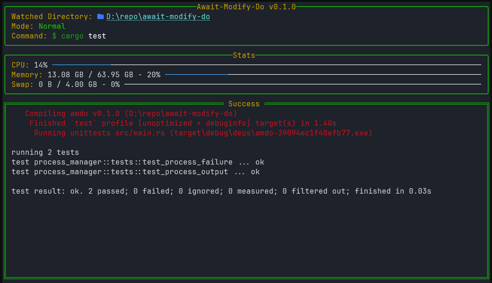

# amdo - Await-Modify-DO

A simple TUI application that runs a command on file save to the working directory.



## Usage

```bash
amdo <command>
```

For example:

```bash
amdo cargo test
```

## Installation

```bash
cargo install amdo
```
